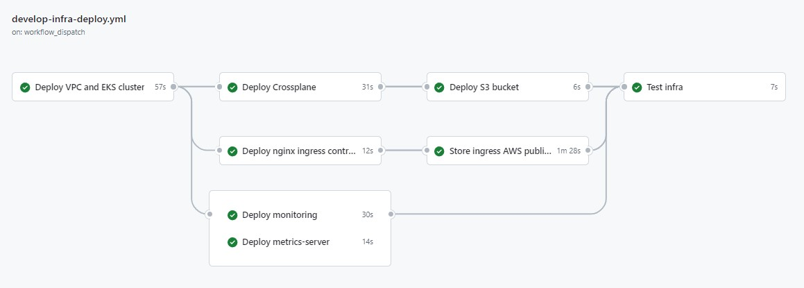

# Description

Github action that does the following:
- Deploys a VPC with an EKS cluster
- Deploys Crossplane in the EKS cluster
- Deploys an S3 bucket with Crossplane

# References

https://docs.crossplane.io/latest/software/install/

https://docs.upbound.io/providers/provider-aws/authentication/#iam-roles-for-service-accounts

https://www.youtube.com/watch?v=aWRWKnniqeM
